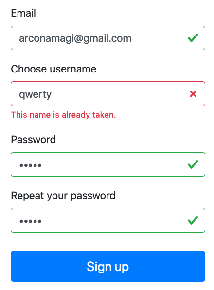

# Ember Sign Up Page Example

This is an example of Sign Up page made with Ember.js.

Sign Up Form has client side validation (thanks to [ember-cp-validations](https://github.com/offirgolan/ember-cp-validations))
for all form fields.

Also, server-side validations are supported.
Currently server is mocked with [ember-cli-mirage](https://github.com/samselikoff/ember-cli-mirage).
Username is additionally checked for the availability.

Note: **In order to make the username already taken - just try to register the same name twice, without reloading the app.**

Just follow installation instructions, run it, and check how it works.

## Prerequisites

You will need the following things properly installed on your computer.

* [Git](https://git-scm.com/)
* [Node.js](https://nodejs.org/) (with npm)
* [Ember CLI](https://ember-cli.com/)
* [Google Chrome](https://google.com/chrome/)

## Installation

* `git clone https://github.com/arconamagi/ember-signup-example.git`
* `cd ember-signup-example`
* `npm install`

## Running / Development

* `ember serve` or `npm run start`
* Visit your app at [http://localhost:4200](http://localhost:4200).
* Visit your tests at [http://localhost:4200/tests](http://localhost:4200/tests).

### Running Tests

* `ember test`
* `ember test --server`

### Linting

`npm run lint` to lint *.js, *.hbs, *.css files.

Or you can check separately:
* `npm run lint:hbs`
* `npm run lint:css`
* `npm run lint:js`
* `npm run lint:js -- --fix`

### Building

* `ember build` (development)
* `ember build --environment production` (production)

However, this package was not tested in production :)

# Copyright and License

Copyright (c) 2019 Dmitriy Labuzov
  
Licensed under the MIT License.
